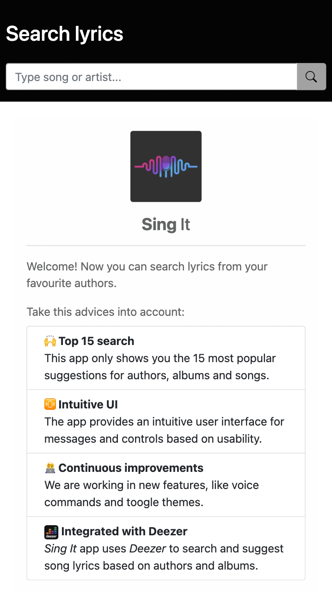
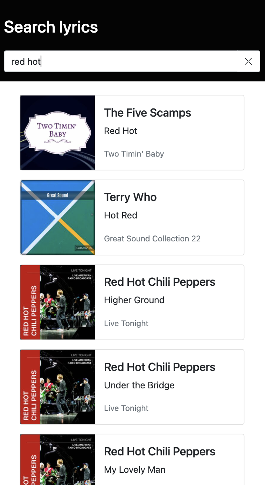
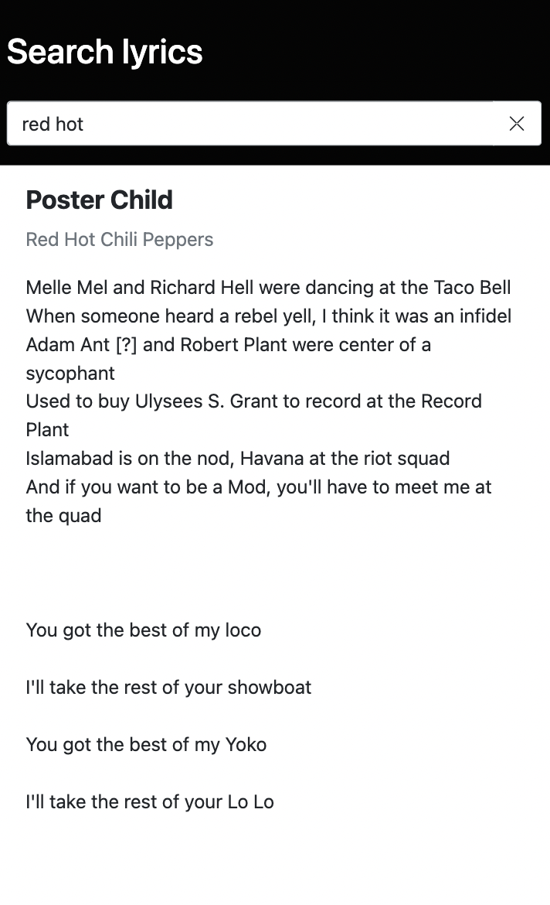

    

<h1 style="text-align: center;"><strong>Sing</strong> It</h1>

## Description
This is a frontend web app built with html, css and javascript.

Integrated with an API that use Deezer for the requests.

Built with first mobile techniques.

UI elements from Bootstrap.

---

## Pending tasks

    ✅ Code split for functions / UI elements
    ✅ Reset button
    ✅ Static home with info
    ❓ Improve UI elements
    ❓ Improme messages and alerts
    ✅ Functions / UI elements commented
    ✅ Added image for albums
    ✅ Text ellipsis for listed songs
    ❓ Change dark / ligth theme
    ❓ Add Voice control search

---

## Contributing

Pull requests are welcome. For major changes, please open an issue first to discuss what you would like to change.

Please make sure to update tests as appropriate.

---

## Captures

    📱 Home with static content 
 

    📱 Search author, song or album

    📱 Lyric from the author, song or album selected
